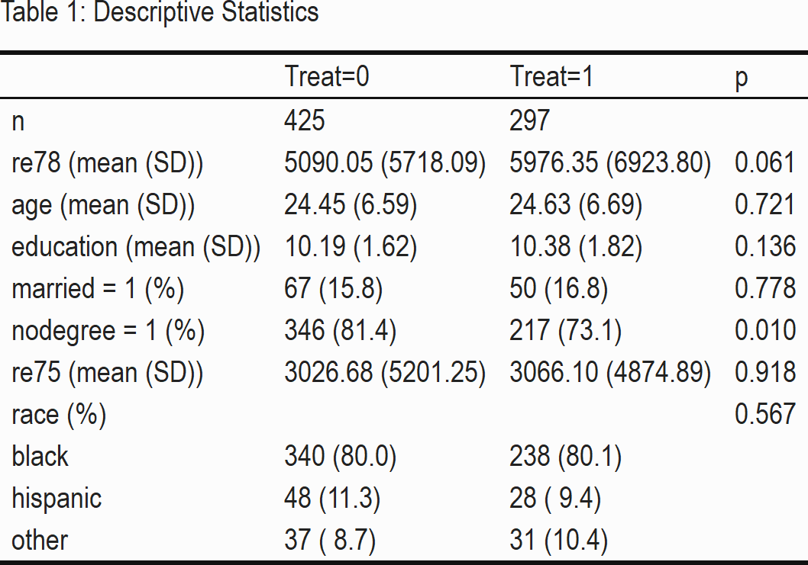
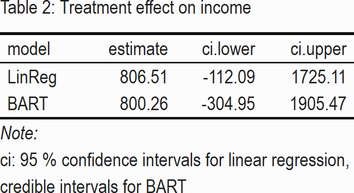
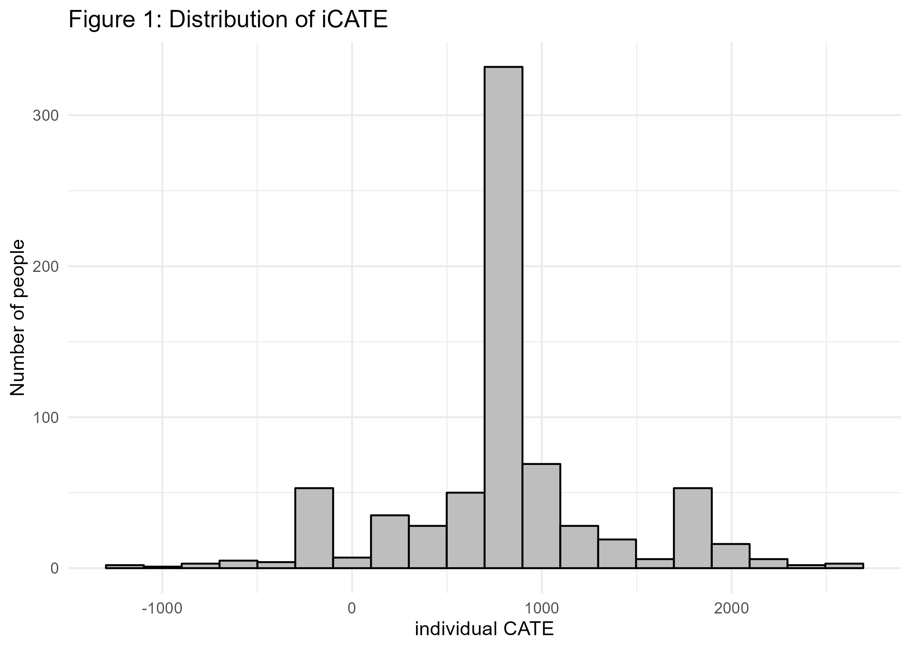
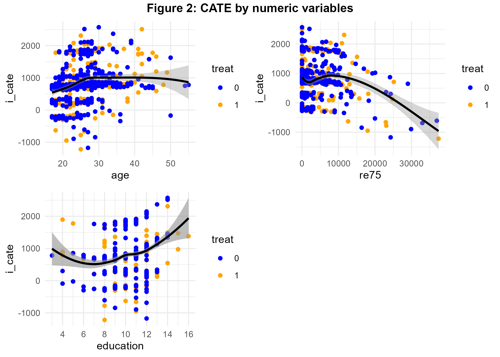
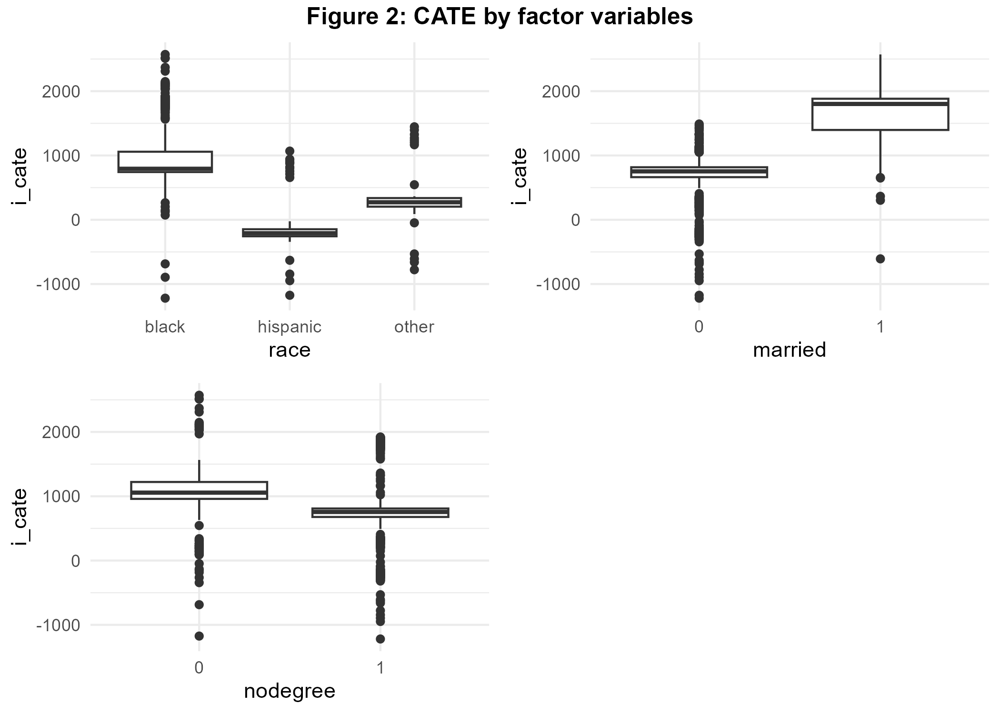

```{r setup, include=TRUE, message=FALSE, warning=FALSE, cache=FALSE} 

#Preliminaries:
knitr::opts_chunk$set(message=FALSE, warning=FALSE, eval = FALSE) #set eval = TRUE when run first

rm(list=ls())

library(tidyverse)
library(haven)
library(bartCause)
library(kableExtra)
library(tableone)
library(gridExtra)
library(grid)

theme_set(theme_light())

dir.create("BartLabor", showWarnings = FALSE)

```


## Introduction

Evaluation of labor market programs is of great importance in order to learn how to better design programs and provide support effectively. Consequently, there is a huge literature on the evaluation of labor market trainings and we add to this by allowing for heterogeneous treatment effects. We will evaluate the effectiveness of a federally-funded labor treatment program [@lalonde1986evaluating] which was implemented in the mid-1970s (US) with the objective of providing work experience. The male subsample we use consists of experimental treatment units and non-experimental comparison units [@dehejia1999causal]. Let us assess whether the treatment had an impact on earnings given available pre-treatment variables. 

## The Data

```{r label='chk1'}

#download the data:
#lalonde <- haven::read_dta("http://www.nber.org/~rdehejia/data/nsw.dta") 
#saveRDS(lalonde, file="BartLabor/lalonde1986.rds")
lalonde_in <- readRDS("BartLabor/lalonde1986.rds") 

lalonde <- lalonde_in %>%
            mutate(race=as_factor(case_when(black==1 ~ 'black',
                                  hispanic==1 ~ 'hispanic',
                                  TRUE ~ 'other'))) %>%
           select(-c(black, hispanic, data_id)) %>%
           relocate(re78, .before = 1)


allvars <- colnames(lalonde)
allvars <- allvars[allvars!='treat'] 
catvars <- c("race", "married", "nodegree")


#Descriptive Statistics:
tab1 <- CreateTableOne(vars = allvars, strata="treat", data = lalonde, factorVars = catvars) 

kableone(tab1, caption = "Table 1: Descriptive Statistics", col.names=c("Treat=0", "Treat=1", "p", ""))  %>%
  remove_column(5) %>%
  kable_classic(full_width = F) %>%
  save_kable("BartLabor/bart_tab1_out.png", zoom = 3)


```

<center>

{width=40%} 

</center>

Table 1 shows that the mean of our variable of interest, the outcome *re78* (income in 1978) is higher in our treatment group. Despite the observational character of our data, we see that the sample is relatively homogeneous concerning the pre-treatment variables: only the indicator variable *nodegree*, on whether a person has a high school diploma, seems to vary between treatment and control group significantly. 

## Strategy & Empirical Analysis

In the potential outcome framework [@rubin2005causal] the average treatment effect (ATE) can be written as the expectation $E(\delta)=E[y^1-y^0]$, where  $y^1$ and $y^0$ are potential outcomes of income in 1978. Under conditional independence assumption $(y^1,y^0)\bot T|X$ these outcomes are independent of treatment $T$ given covariates $X$. 

We use 2 methods in order to estimate the average treatment effect (ATE).
Firstly, we apply the well known linear regression for estimation and risk adjustment [eg. @angrist2009mostly; @pearl2013linear]. Secondly, we consider Bayesian Additive Regression Trees [@chipman2010bart; @hill2011bayesian], a machine learning model recently becoming popular that allows to detect relevant interactions in the data generating process and can be used to estimate heterogeneous treatment effects as well [@carnegie2019examining;  @hill2020bayesian]. 


```{r label='chk2'}

#Linear regression

lm <- lm(re78 ~ treat + re75 + age + education + race + married + nodegree, data=lalonde)

ate_lm <- as.data.frame(coef(lm)) %>%
        bind_cols(confint(lm)) %>%
        rownames_to_column() %>%
        filter(rowname=='treat') %>%
        rename(estimate=`coef(lm)`, ci.lower=`2.5 %`, ci.upper=`97.5 %`) %>%
        mutate(model='LinReg') %>%
        relocate(model, .before=1) %>%
        select(-rowname)
  
#BART

bc_fit <- bartc(lalonde[,'re78'], lalonde[,'treat'], lalonde[,3:8], n.samples = 1000L, estimand='ate',
                method.rsp='bart', method.trt='glm', verbose = FALSE) 


ate_bart <- summary(bc_fit)$estimates %>%
            select(-sd) %>%
            mutate(model='BART')  %>%
            relocate(model, .before=1)

#Prepare ATE-Output
ate <- ate_lm %>%
      bind_rows(ate_bart)

rownames(ate) <- NULL

kable(
  ate,
  format="html", 
  digits = 2,
  caption = "Table 2: Treatment effect on income"
) %>%
  kable_classic(full_width = F) %>% 
  footnote(general = "ci: 95 % confidence intervals for linear regression, \n credible intervals for BART ") %>%
  save_kable("BartLabor/bart_tab2_out.png", zoom = 3)


```

<center>

{width=32%} 

</center>

We recognize in Table 2 that the treatment effect of BART is very similar to linear regression. The ATE-point estimates are both positive, suggesting that program participation increases average income by about 800 USD. However, both 95% confidence-, credible intervals show that there is a lot of variability in the data -- an effect of zero cannot be rejected.

In addition to one point estimate we often would like to have information on treatment effects for specific subgroups. This could help us to redesign the program or allow for more effective enrollment. Obviously, these questions can be of interest also in other areas -- imagine online marketing or personalized medicine for example. Thankfully, BART can also provide treatment effects for each observation in the data, which are called the individual conditional average treatment effects (iCATE): $\tau(X_i)=E[y^1_i-y^0_i|X_i]$. Let us have a look at the distribution of individual CATE in Figure 1. 


```{r label='chk3'}

#Extract individual treatment effects
i_cate <- fitted(bc_fit, type="icate", sample = c("all"))


data_cate <- lalonde %>%
  bind_cols(as.data.frame(i_cate))
  

#Histogram CATE
bart_p1 <- data_cate %>%
  ggplot(aes(x=i_cate)) +
  geom_histogram(bins=20, color='black', fill='grey') + 
  theme_minimal() + labs(y = 'Number of people', x='individual CATE', title='Figure 1: Distribution of iCATE')


ggsave(bart_p1, file="BartLabor/bart_p1.png")  # import in markdown

```

{width=70%}

Interestingly, although the peak of the distribution is around 800 similar to ATE from above, the treatment effects vary a lot. There are even individuals for which a negative effect can be seen. In order to better understand the data generating process, we want to check next whether the individual treatment effects vary with explanatory variables, that could moderate the treatment effect. Figure 2 visualizes the treatment effects dependent on numeric variables age, income and years of education before treatment.


```{r label='chk4'}

#Scatterplots:

#age
p2 <- data_cate %>%
  mutate(treat=as_factor(treat)) %>%
  ggplot(aes(y=i_cate, x=age)) +
  geom_point(aes(color=treat)) +
  scale_colour_manual(values=c("blue", "orange")) +
  geom_smooth(color='black') +
  theme_minimal() 


#income
p3 <- data_cate %>%
   mutate(treat=as_factor(treat)) %>%
  ggplot(aes(y=i_cate, x=re75)) +
  geom_point(aes(color=treat)) +
  scale_colour_manual(values=c("blue", "orange")) +
  geom_smooth(color='black') +
  theme_minimal() 


#educ
p4 <- data_cate %>%
   mutate(treat=as_factor(treat)) %>%
  ggplot(aes(y=i_cate, x=education)) +
  geom_point(aes(color=treat)) +
  geom_smooth(aes(y=i_cate, x=education)) +
  scale_colour_manual(values=c("blue", "orange")) +
  geom_smooth(color='black') +
  scale_x_continuous(breaks = rep(1:8)*2) +
  theme_minimal() 

#combine  plots next to each other
title1=textGrob("Figure 2: CATE by numeric variables", gp=gpar(fontface="bold"))
bart_p2 <- arrangeGrob(p2,  p3, p4, ncol=2, top=title1) 

ggsave(bart_p2, file="BartLabor/bart_p2.png")  # import in markdown

```

{width=70%}

We see that program effectiveness increased with age until a threshold of 30 years. The program seems to have been most effective for people between 5 and 10K USD whereas the relationship between years of education and iCATE is U-shaped. The scatterplots allow to visually distinguish iCATE by treatment status -- a very nice feature as discussed above. Next let us assess the interaction of our treatment with the factor variables.


```{r label='chk5'}

#Boxplots:
#race
p5 <- data_cate %>%
  ggplot(aes(y=i_cate, x=race)) +
  geom_boxplot()  +
  theme_minimal() 

#married 
p6 <- data_cate %>%
  mutate(married=as.factor(married)) %>%
  ggplot(aes(y=i_cate, x=married)) +
  geom_boxplot() +
  theme_minimal() 

p7 <- data_cate %>%
  mutate(nodegree=as.factor(nodegree)) %>%
  ggplot(aes(y=i_cate, x=nodegree)) +
  geom_boxplot() +
  theme_minimal() 

title2=textGrob("Figure 2: CATE by factor variables", gp=gpar(fontface="bold"))
bart_p3 <- arrangeGrob(p5,  p6, p7, ncol=2, top=title2) 

ggsave(bart_p3, file="BartLabor/bart_p3.png")  # import in markdown

```

{width=70%}

Figure 3 reveals that black colored benefited most from the program whereas being hispanic is associated with negative CATE. Married people benefited highly from program participation as well.

## Discussion

We analysed the impact of a labor market program by using linear regression and BART, a tree based nonparametric Bayesian regression approach which very successfully recovers the underlying data generating process in the presence of interactions. We have found some evidence for effect moderation of the treatment, especially being married and black color are associated with a positive treatment effect. The relation between pre-treatment income and iCATE is nonlinear. Marital status and income were found to generate interaction effects by @rolling2014estimation as well.

Let us recall the assumption that all relevant control variables are accounted for in the analysis (ignorability). This does not necessary hold true and is also emphasized by the seminal study of @lalonde1986evaluating. See for example @vanderweele2011new for a discussion of confounder selection. Furthermore, when estimating ATE we mainly focused on modeling the outcome equation of our treatment, hence we implicitly assume no selection into treatment. Luckily, other treatment effects (ATT, ATC) can be generated by re-weighting towards the population of interest [eg. @morgan20086], both in case of linear regression and BART. 

---
nocite: |
  @haven, @kable, @kableextra
---


## References