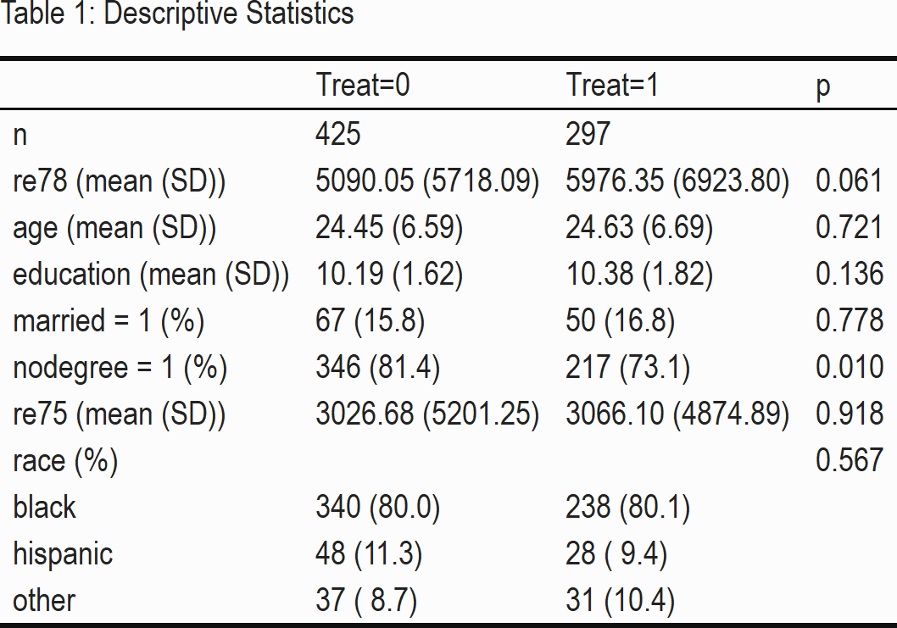
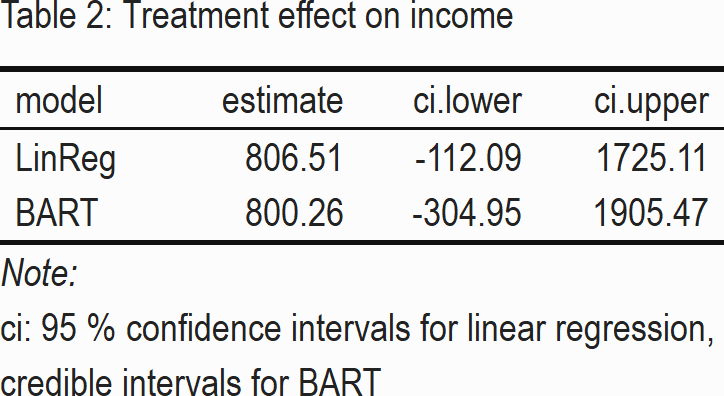
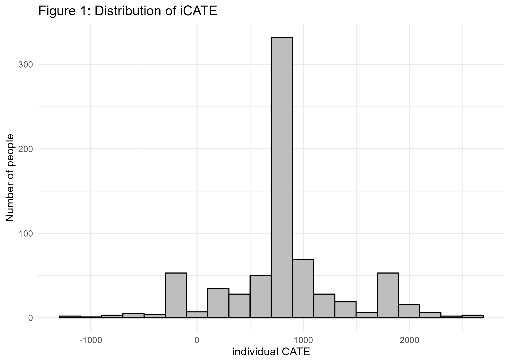
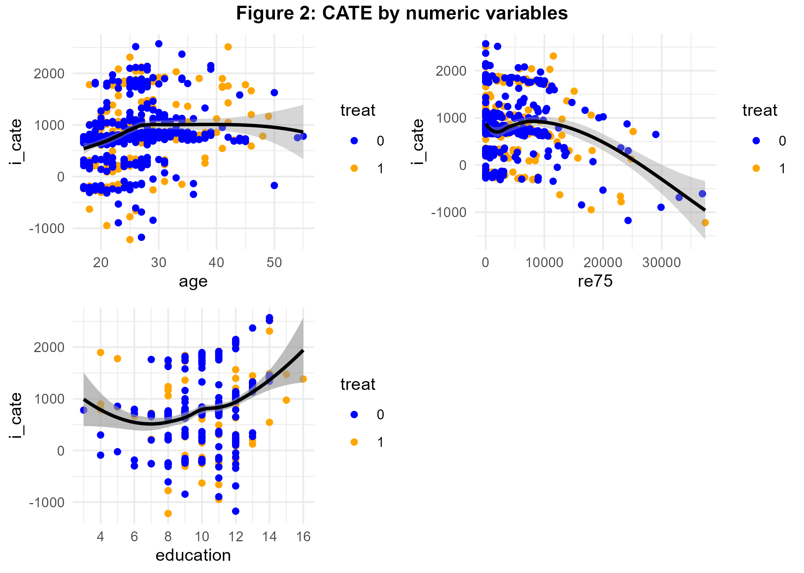
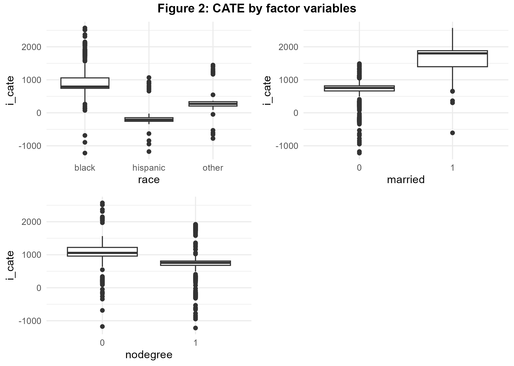

# Linear Regression and BART: Program Evaluation in the Labor Market
Florian Klohn, 1 Oct 2022

``` r
#Preliminaries:
knitr::opts_chunk$set(message=FALSE, warning=FALSE, eval = FALSE) #set eval = TRUE when run first

rm(list=ls())

library(tidyverse)
library(haven)
library(bartCause)
library(kableExtra)
library(tableone)
library(gridExtra)
library(grid)

theme_set(theme_light())

dir.create("BartLabor", showWarnings = FALSE)
```

## Introduction

Evaluation of labor market programs is of great importance in order to
learn how to better design programs and provide support effectively.
Consequently, there is a huge literature on the evaluation of labor
market trainings and we add to this by allowing for heterogeneous
treatment effects. We will evaluate the effectiveness of a
federally-funded labor treatment program (LaLonde 1986) which was
implemented in the mid-1970s (US) with the objective of providing work
experience. The male subsample we use consists of experimental treatment
units and non-experimental comparison units (Dehejia and Wahba 1999).
Let us assess whether the treatment had an impact on earnings given
available pre-treatment variables.

## The Data

``` r
#download the data:
#lalonde <- haven::read_dta("http://www.nber.org/~rdehejia/data/nsw.dta") 
#saveRDS(lalonde, file="BartLabor/lalonde1986.rds")
lalonde_in <- readRDS("BartLabor/lalonde1986.rds") 

lalonde <- lalonde_in %>%
            mutate(race=as_factor(case_when(black==1 ~ 'black',
                                  hispanic==1 ~ 'hispanic',
                                  TRUE ~ 'other'))) %>%
           select(-c(black, hispanic, data_id)) %>%
           relocate(re78, .before = 1)


allvars <- colnames(lalonde)
allvars <- allvars[allvars!='treat'] 
catvars <- c("race", "married", "nodegree")


#Descriptive Statistics:
tab1 <- CreateTableOne(vars = allvars, strata="treat", data = lalonde, factorVars = catvars) 

kableone(tab1, caption = "Table 1: Descriptive Statistics", col.names=c("Treat=0", "Treat=1", "p", ""))  %>%
  remove_column(5) %>%
  kable_classic(full_width = F) %>%
  save_kable("BartLabor/bart_tab1_out.png", zoom = 3)
```

<center>



</center>

Table 1 shows that the mean of our variable of interest, the outcome
*re78* (income in 1978) is higher in our treatment group. Despite the
observational character of our data, we see that the sample is
relatively homogeneous concerning the pre-treatment variables: only the
indicator variable *nodegree*, on whether a person has a high school
diploma, seems to vary between treatment and control group
significantly.

## Strategy & Empirical Analysis

In the potential outcome framework (Rubin 2005) the average treatment
effect (ATE) can be written as the expectation
*E*(*δ*) = *E*\[*y*<sup>1</sup>−*y*<sup>0</sup>\], where *y*<sup>1</sup>
and *y*<sup>0</sup> are potential outcomes of income in 1978. Under
conditional independence assumption
(*y*<sup>1</sup>,*y*<sup>0</sup>)⊥*T*\|*X* these outcomes are
independent of treatment *T* given covariates *X*.

We use 2 methods in order to estimate the average treatment effect
(ATE). Firstly, we apply the well known linear regression for estimation
and risk adjustment (eg. Angrist and Pischke 2009; Pearl 2013).
Secondly, we consider Bayesian Additive Regression Trees (Chipman,
George, and McCulloch 2010; J. L. Hill 2011), a machine learning model
recently becoming popular that allows to detect relevant interactions in
the data generating process and can be used to estimate heterogeneous
treatment effects as well (Carnegie, Dorie, and Hill 2019; J. Hill,
Linero, and Murray 2020).

``` r
#Linear regression

lm <- lm(re78 ~ treat + re75 + age + education + race + married + nodegree, data=lalonde)

ate_lm <- as.data.frame(coef(lm)) %>%
        bind_cols(confint(lm)) %>%
        rownames_to_column() %>%
        filter(rowname=='treat') %>%
        rename(estimate=`coef(lm)`, ci.lower=`2.5 %`, ci.upper=`97.5 %`) %>%
        mutate(model='LinReg') %>%
        relocate(model, .before=1) %>%
        select(-rowname)
  
#BART

bc_fit <- bartc(lalonde[,'re78'], lalonde[,'treat'], lalonde[,3:8], n.samples = 1000L, estimand='ate',
                method.rsp='bart', method.trt='glm', verbose = FALSE) 


ate_bart <- summary(bc_fit)$estimates %>%
            select(-sd) %>%
            mutate(model='BART')  %>%
            relocate(model, .before=1)

#Prepare ATE-Output
ate <- ate_lm %>%
      bind_rows(ate_bart)

rownames(ate) <- NULL

kable(
  ate,
  format="html", 
  digits = 2,
  caption = "Table 2: Treatment effect on income"
) %>%
  kable_classic(full_width = F) %>% 
  footnote(general = "ci: 95 % confidence intervals for linear regression, \n credible intervals for BART ") %>%
  save_kable("BartLabor/bart_tab2_out.png", zoom = 3)
```

<center>



</center>

We recognize in Table 2 that the treatment effect of BART is very
similar to linear regression. The ATE-point estimates are both positive,
suggesting that program participation increases average income by about
800 USD. However, both 95% confidence-, credible intervals show that
there is a lot of variability in the data – an effect of zero cannot be
rejected.

In addition to one point estimate we often would like to have
information on treatment effects for specific subgroups. This could help
us to redesign the program or allow for more effective enrollment.
Obviously, these questions can be of interest also in other areas –
imagine online marketing or personalized medicine for example.
Thankfully, BART can also provide treatment effects for each observation
in the data, which are called the individual conditional average
treatment effects (iCATE):
*τ*(*X*<sub>*i*</sub>) = *E*\[*y*<sub>*i*</sub><sup>1</sup>−*y*<sub>*i*</sub><sup>0</sup>\|*X*<sub>*i*</sub>\].
Let us have a look at the distribution of individual CATE in Figure 1.

``` r
#Extract individual treatment effects
i_cate <- fitted(bc_fit, type="icate", sample = c("all"))


data_cate <- lalonde %>%
  bind_cols(as.data.frame(i_cate))
  

#Histogram CATE
bart_p1 <- data_cate %>%
  ggplot(aes(x=i_cate)) +
  geom_histogram(bins=20, color='black', fill='grey') + 
  theme_minimal() + labs(y = 'Number of people', x='individual CATE', title='Figure 1: Distribution of iCATE')


ggsave(bart_p1, file="BartLabor/bart_p1.png")  # import in markdown
```



Interestingly, although the peak of the distribution is around 800
similar to ATE from above, the treatment effects vary a lot. There are
even individuals for which a negative effect can be seen. In order to
better understand the data generating process, we want to check next
whether the individual treatment effects vary with explanatory
variables, that could moderate the treatment effect. Figure 2 visualizes
the treatment effects dependent on numeric variables age, income and
years of education before treatment.

``` r
#Scatterplots:

#age
p2 <- data_cate %>%
  mutate(treat=as_factor(treat)) %>%
  ggplot(aes(y=i_cate, x=age)) +
  geom_point(aes(color=treat)) +
  scale_colour_manual(values=c("blue", "orange")) +
  geom_smooth(color='black') +
  theme_minimal() 


#income
p3 <- data_cate %>%
   mutate(treat=as_factor(treat)) %>%
  ggplot(aes(y=i_cate, x=re75)) +
  geom_point(aes(color=treat)) +
  scale_colour_manual(values=c("blue", "orange")) +
  geom_smooth(color='black') +
  theme_minimal() 


#educ
p4 <- data_cate %>%
   mutate(treat=as_factor(treat)) %>%
  ggplot(aes(y=i_cate, x=education)) +
  geom_point(aes(color=treat)) +
  geom_smooth(aes(y=i_cate, x=education)) +
  scale_colour_manual(values=c("blue", "orange")) +
  geom_smooth(color='black') +
  scale_x_continuous(breaks = rep(1:8)*2) +
  theme_minimal() 

#combine  plots next to each other
title1=textGrob("Figure 2: CATE by numeric variables", gp=gpar(fontface="bold"))
bart_p2 <- arrangeGrob(p2,  p3, p4, ncol=2, top=title1) 

ggsave(bart_p2, file="BartLabor/bart_p2.png")  # import in markdown
```



We see that program effectiveness increased with age until a threshold
of 30 years. The program seems to have been most effective for people
between 5 and 10K USD whereas the relationship between years of
education and iCATE is U-shaped. The scatterplots allow to visually
distinguish iCATE by treatment status – a very nice feature as discussed
above. Next let us assess the interaction of our treatment with the
factor variables.

``` r
#Boxplots:
#race
p5 <- data_cate %>%
  ggplot(aes(y=i_cate, x=race)) +
  geom_boxplot()  +
  theme_minimal() 

#married 
p6 <- data_cate %>%
  mutate(married=as.factor(married)) %>%
  ggplot(aes(y=i_cate, x=married)) +
  geom_boxplot() +
  theme_minimal() 

p7 <- data_cate %>%
  mutate(nodegree=as.factor(nodegree)) %>%
  ggplot(aes(y=i_cate, x=nodegree)) +
  geom_boxplot() +
  theme_minimal() 

title2=textGrob("Figure 2: CATE by factor variables", gp=gpar(fontface="bold"))
bart_p3 <- arrangeGrob(p5,  p6, p7, ncol=2, top=title2) 

ggsave(bart_p3, file="BartLabor/bart_p3.png")  # import in markdown
```



Figure 3 reveals that black colored benefited most from the program
whereas being hispanic is associated with negative CATE. Married people
benefited highly from program participation as well.

## Discussion

We analysed the impact of a labor market program by using linear
regression and BART, a tree based nonparametric Bayesian regression
approach which very successfully recovers the underlying data generating
process in the presence of interactions. We have found some evidence for
effect moderation of the treatment, especially being married and black
color are associated with a positive treatment effect. The relation
between pre-treatment income and iCATE is nonlinear. Marital status and
income were found to generate interaction effects by Rolling (2014) as
well.

Let us recall the assumption that all relevant control variables are
accounted for in the analysis (ignorability). This does not necessary
hold true and is also emphasized by the seminal study of LaLonde (1986).
See for example VanderWeele and Shpitser (2011) for a discussion of
confounder selection. Furthermore, when estimating ATE we mainly focused
on modeling the outcome equation of our treatment, hence we implicitly
assume no selection into treatment. Luckily, other treatment effects
(ATT, ATC) can be generated by re-weighting towards the population of
interest (eg. Morgan and Todd 2008), both in case of linear regression
and BART.

## References

Angrist, Joshua D, and Jörn-Steffen Pischke. 2009. *Mostly Harmless
Econometrics: An Empiricist’s Companion*. Princeton university press.

Carnegie, Nicole, Vincent Dorie, and Jennifer L Hill. 2019. “Examining
Treatment Effect Heterogeneity Using BART.” *Observational Studies* 5
(2): 52–70.

Chipman, Hugh A, Edward I George, and Robert E McCulloch. 2010. “BART:
Bayesian Additive Regression Trees.” *The Annals of Applied Statistics*
4 (1): 266–98.

Dehejia, Rajeev H, and Sadek Wahba. 1999. “Causal Effects in
Nonexperimental Studies: Reevaluating the Evaluation of Training
Programs.” *Journal of the American Statistical Association* 94 (448):
1053–62.

Hill, Jennifer L. 2011. “Bayesian Nonparametric Modeling for Causal
Inference.” *Journal of Computational and Graphical Statistics* 20 (1):
217–40.

Hill, Jennifer, Antonio Linero, and Jared Murray. 2020. “Bayesian
Additive Regression Trees: A Review and Look Forward.” *Annual Review of
Statistics and Its Application* 7 (1).

LaLonde, Robert J. 1986. “Evaluating the Econometric Evaluations of
Training Programs with Experimental Data.” *The American Economic
Review*, 604–20.

Morgan, Stephen L, and Jennifer J Todd. 2008. “6. A Diagnostic Routine
for the Detection of Consequential Heterogeneity of Causal Effects.”
*Sociological Methodology* 38 (1): 231–82.

Pearl, Judea. 2013. “Linear Models: A Useful ‘Microscope’ for Causal
Analysis.” *Journal of Causal Inference* 1 (1): 155–70.

Rolling, Craig Anthony. 2014. “Estimation of Conditional Average
Treatment Effects.” PhD thesis, University of Minnesota.

Rubin, Donald B. 2005. “Causal Inference Using Potential Outcomes:
Design, Modeling, Decisions.” *Journal of the American Statistical
Association* 100 (469): 322–31.

VanderWeele, Tyler J, and Ilya Shpitser. 2011. “A New Criterion for
Confounder Selection.” *Biometrics* 67 (4): 1406–13.

Wickham, Hadley, Evan Miller, and Danny Smith. 2022. *Haven: Import and
Export ’SPSS’, ’Stata’ and ’SAS’ Files*.
<https://CRAN.R-project.org/package=haven>.

Zhu, Hao. 2021. *kableExtra: Construct Complex Table with ’Kable’ and
Pipe Syntax*. <https://CRAN.R-project.org/package=kableExtra>.
